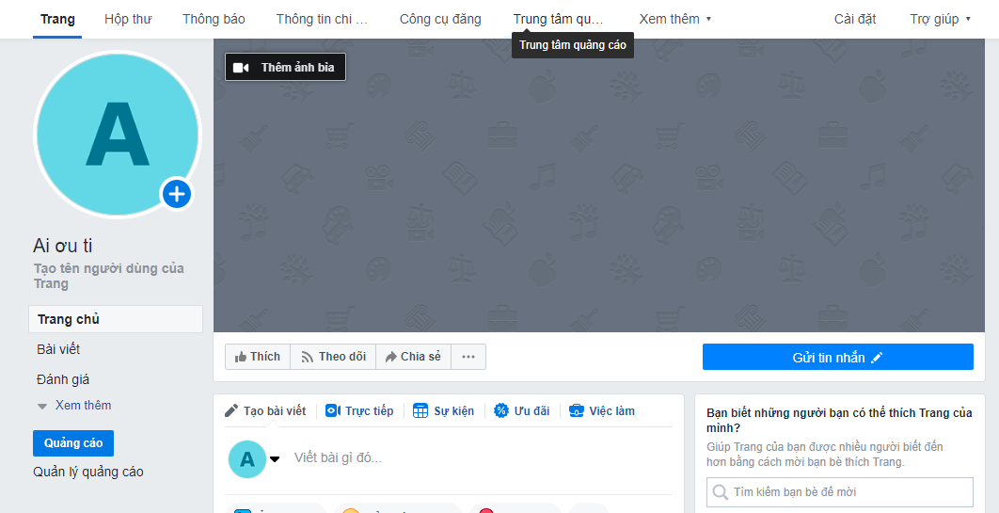
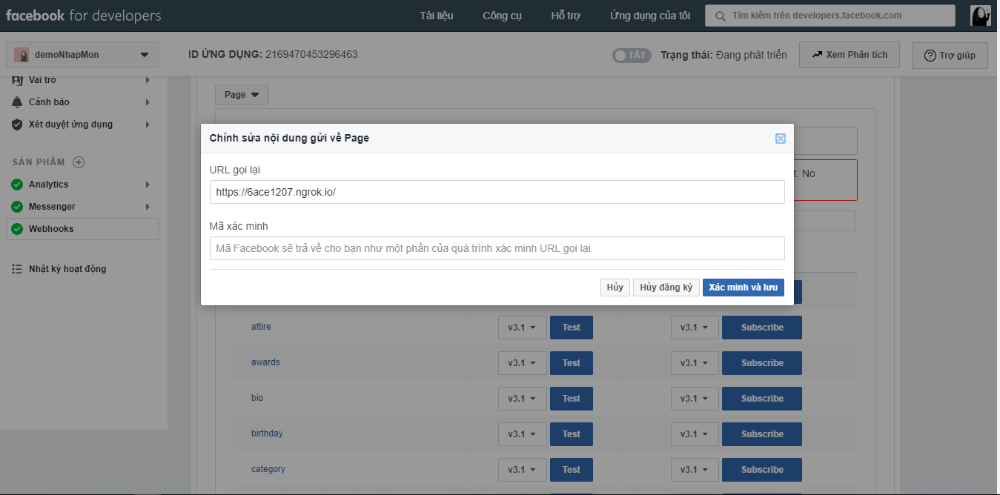

# Control ESP8266 over Facebook chatbot
## Overview
This is a project  made to control ESP8266 by message on Messsenger. You can develop it to control home lights...  
**Sample:**  

## Folder structure
- web-callback : Chatbot and MQTT communication.
- esp8266 : Code for ESP8266.
## Prerequirement
- MQTT broker: I suggest [Eclipse Mosquitto](https://mosquitto.org/) on Ubuntu.
- Python packages: flask, requests, paho-mqtt.
  ```
  cd web-callback; pip install -r requirements.txt
  ```
- Arduino IDE.
- [Pubsubclient](https://github.com/knolleary/pubsubclient) library.
## Installation
### Create a facebook page and register webhook  
1. Create a page for your chatbot.
   
2. Go to [facebook for developer](https://developers.facebook.com/) and create an app.
3. Create webhook for your page. It will be the URL of your chatbot. [docs1](https://developers.facebook.com/docs/messenger-platform/webhook/), [docs2](https://developers.facebook.com/docs/messenger-platform/getting-started/app-setup) 
  
### Config and start chatbot
1. Start mosquitto broker.
    ```
    sudo service start mosquitto 
    ```
   You can use [ngrok](https://ngrok.com/) to tunnel your broker.
2. Change configuration in **web-callback.py** to match your webhook setting and topic you use to communicate with ESP8266.
3. Start chat bot
    ```
    python3 web-callback.py
    ```
    Or run it in development mode
    ```
    export FLASK_ENV=development
    python3 web_callback.py
    ```
### Flash ESP8266
1. Change configurations in esp8266.ino
2. Upload the sketch.

